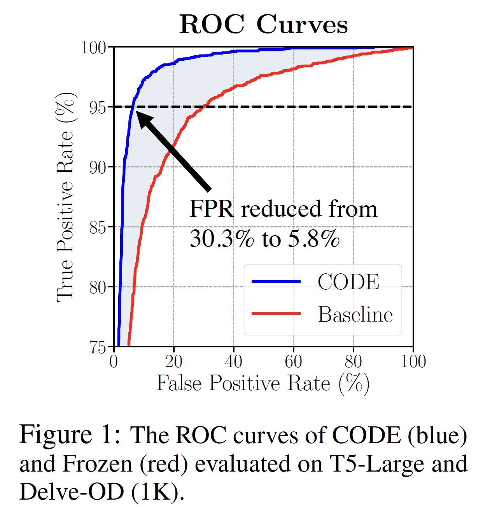
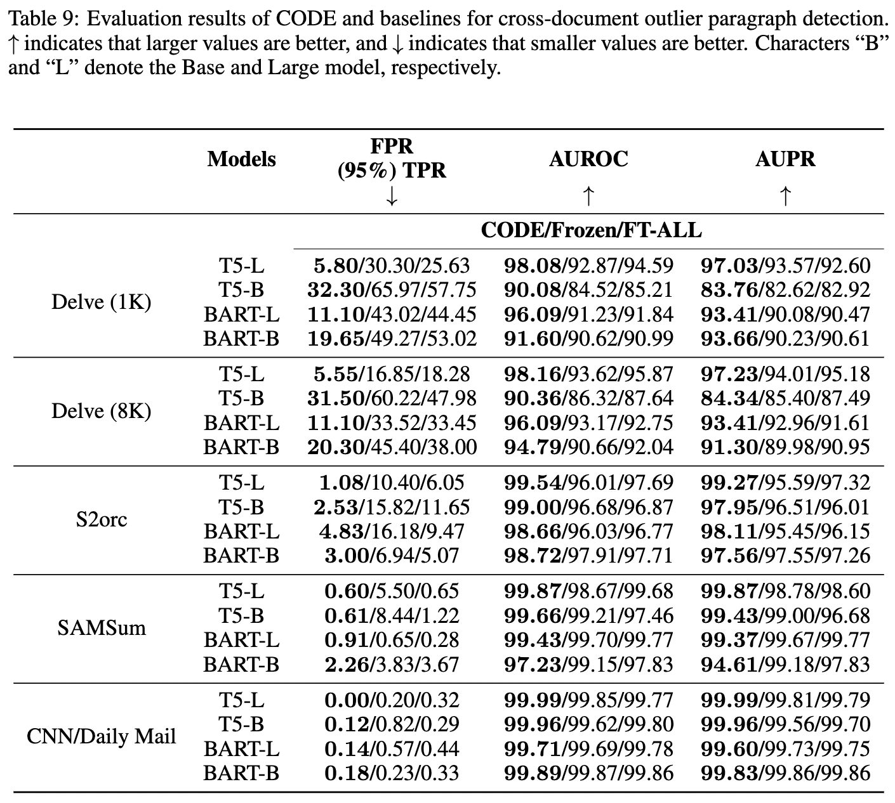
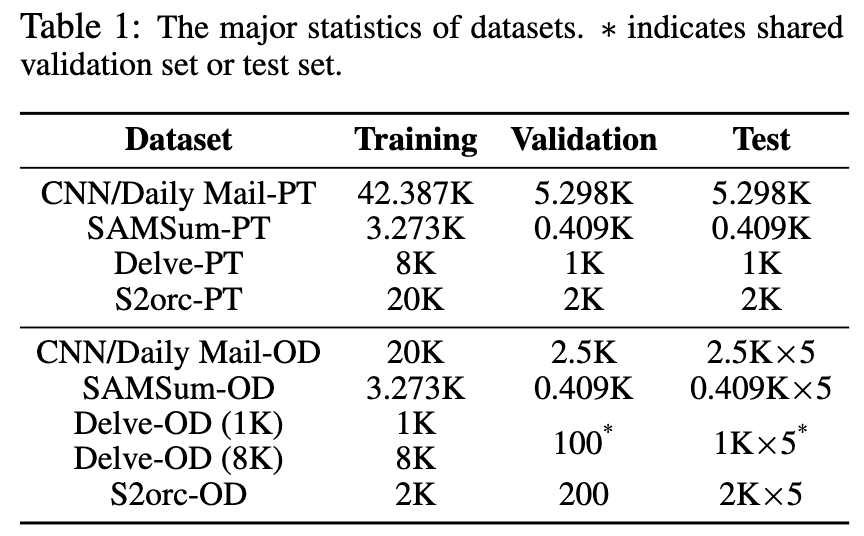
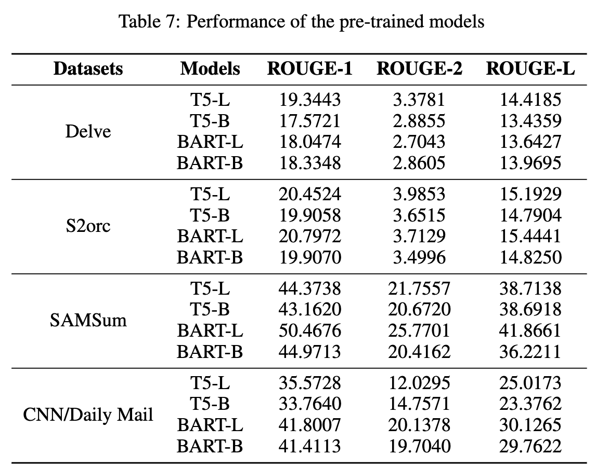

# CODE: <u>C</u>ross Attention-based <u>O</u>utlier Paragraph <u>DE</u>tector

This is an implementation of CODE for detecting cross-document or cross-domain outlier paragraphs. The method is presented in the paper "**Revealing The Intrinsic Ability of Generative Text Summarizers for Outlier Paragraph Detection**". Our method achieves a 5.8% FPR at 95\% TPR vs. 30.3\% by supervised baseline on the T5-Large and Delve domain.

<p align="center">

</p>

## Experimental Results
We primarily focus on generative language models using the [Transformer](https://arxiv.org/abs/1706.03762) encoder-decoder architecture, specifically [BART](https://arxiv.org/abs/1910.13461) and [T5](https://arxiv.org/abs/1910.10683), to construct CODE and  two baselines. The setups of the CODE and baselines can be found in the paper. To see the influence of the model size, we select BART-Base, BART-Large, T5-Base and T5-Large. We use FPR at 95% TPR, AUROC and AUPR as evaluation metrics. The experimental results are shown as follows. 



## Datasets

We choose four source datasets: [CNN/Daily Mail](https://arxiv.org/abs/1602.06023), [SAMSum](https://aclanthology.org/D19-5409), [Delve](https://aclanthology.org/2021.acl-long.473.pdf) and [S2orc](https://aclanthology.org/2021.acl-long.473.pdf) to build our datasets. The first dataset comes from the news domain, the second from dialogues, and the last two belong to the academic domain. We introduce two data pipelines to create pre-training datasets and outlier paragraph detection datasets, respectively. Detail can be found in the paper. We create four pre-training datasets with cross-document outlier paragraphs; We create four cross-document outlier detection datasets and sixteen cross-domain outlier detection datasets by sampling outlier paragraphs from the same domain and different domain datasets, respectively. The statistics of the datasets are presented as follows.

<p align="center">

</p>

Downloading Datasets:

* **[Pre-training (PT)](https://drive.google.com/file/d/1m9HSEzHcT0tGcaL6J_QoRB3mDkQH40K9/view?usp=sharing)**
* **[Outlier Detection (OD)](https://www.dropbox.com/s/kp3my3412u5k9rl/Imagenet_resize.tar.gz)**

## Text Summarizers Pre-training with Cross-document Outliers
We employ the implementation of BART and T5 in [Hugging Face Transformers](https://huggingface.co/). We use [ROUGE](https://aclanthology.org/W04-3252/) to assess the generative quality. The evaluation results are shown as follow.

<p align="center">

</p>

For pre-training, the initial parameters of the models need to be downloaded and placed in the appropriate directory:
* **[T5]()**
* **[BART]()**


Here is an example of pre-training T5-Large on Delve-PT:
```
cd ./CODE/t5
cp "PATH of pytorch_model.bin you downloaded" ./init_model/large
python train_eval_origin_t5.py -model_type large  -dataset_path "PATH TO DATASETS" -dataset_type delve
```

Downloading Pre-trained Models  (Checkpoints with the lowest evaluation loss are selected):
* **[T5]()**
* **[BART]()**


## GLM-based Outlier Paragraph Detection
### Summary generation for the samples of outlier detection dataset 
To improve computational efficiency, we pre-generate summary under each outlier detection dataset as well as each model, and the generated summary is saved in the corresponding json file. This is an example of summary generation in the case of T5-Large and Delve-OD.

```
cd ./CODE/t5
python generation.py -mode train -model_type large -dataset_type delve_1k -ckpts_path ./ckpts/large/delve_0.0001_15_614
python generation.py -mode valid -model_type large -dataset_type delve_1k -ckpts_path ./ckpts/large/delve_0.0001_15_614
python generation.py -mode test -model_type large -dataset_type delve_1k -ckpts_path ./ckpts/large/delve_0.0001_15_614
```

### CODE
There are two hyper-parameters $\alpha$ and $\beta$ in CODE. We first run the hyper-parameter tuning on $\alpha$ and $\beta$. We search the hyper-parameters $\alpha$ in the range $[0,2]$ with an interval of $0.1$ and $\beta$ in the range $[0,2]$ with an interval of $0.2$. This implies that we search for the best setting in 231 hyper-parameter combinations. We select the $\alpha$ and $\beta$ with the lowest FPR at 95\% TPR for testing.

Here is an example of searching the hyper-parameters of CODE on T5-Large and Delve-OD (1K):

```
cd ./CODE/t5
python hyperparameter_search.py  -model_type large  -dataset_type delve_1k -ckpts_path ./ckpts/large/delve_0.0001_15_614 -layer_num 23
```

After obtaining the optimal hyper-parameters, we evaluate the performance of CODE. Here is an example of evaluating CODE on T5-Large and Delve-OD (1K):

```
cd ./CODE/t5
python test_t5.py -model_type large  -dataset_type delve_1K -ckpts_path ./ckpts/large/delve_0.0001_15_614 -layer_num 23
```

Here is an example of output.
```
{"95fpr":0.058, "auroc":0.9808,"aupr":0.9703}
```


