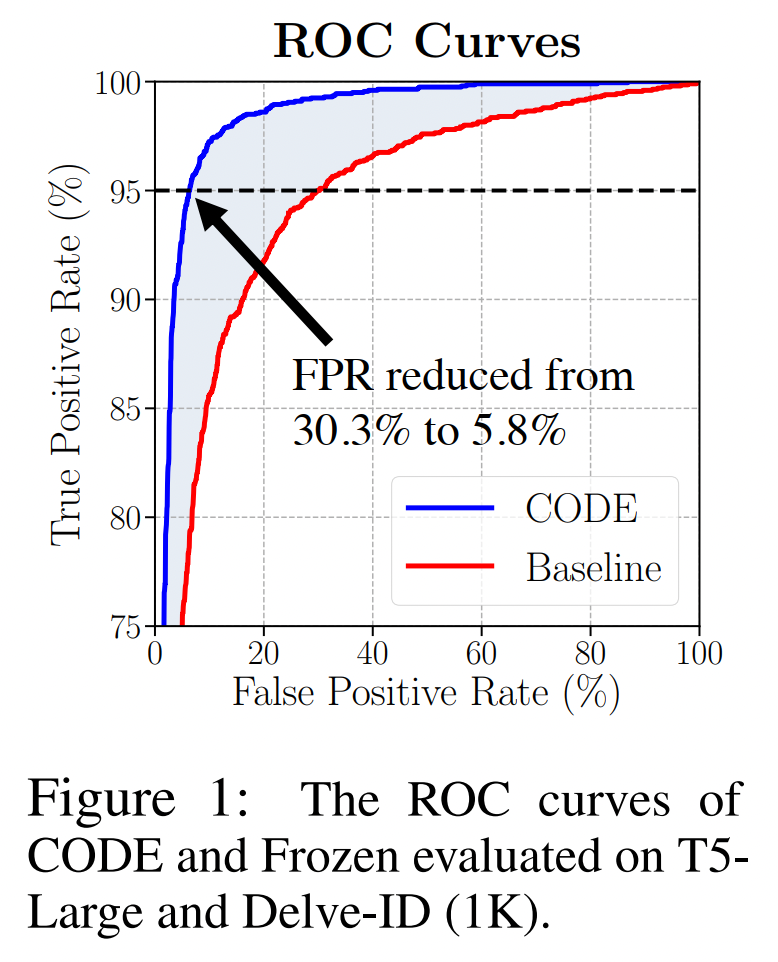
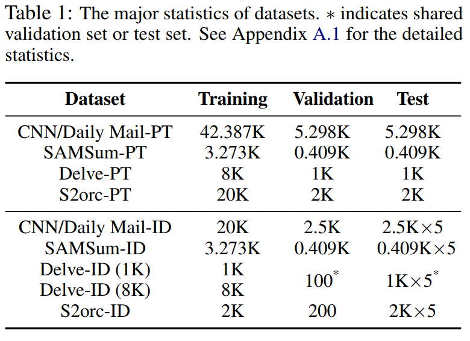
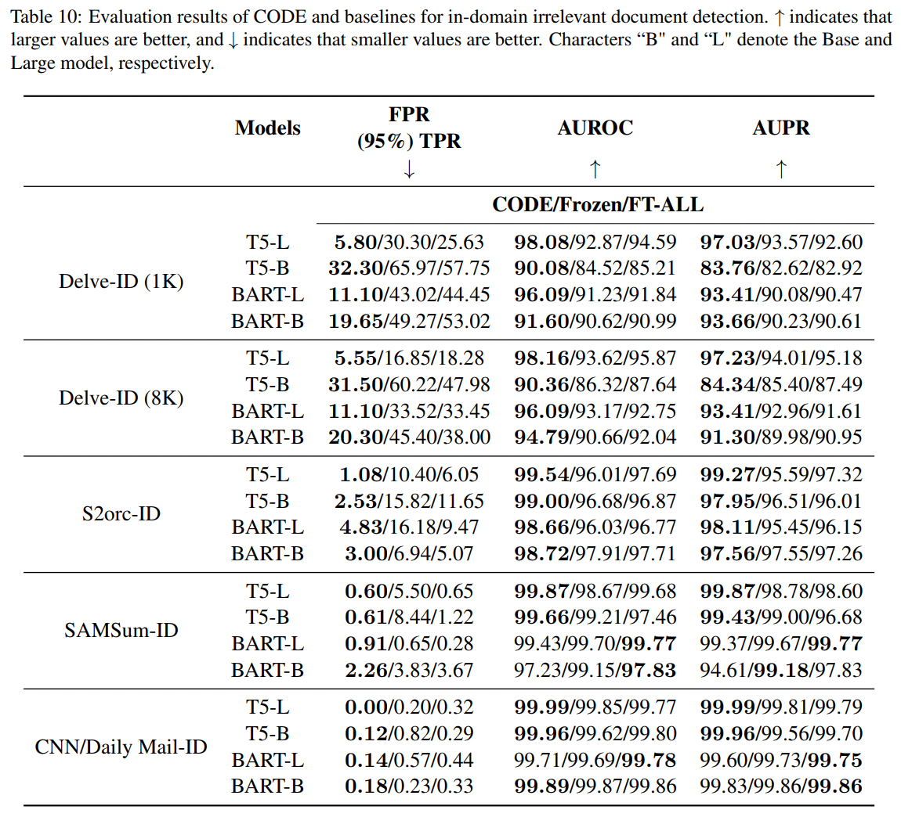

# CODE: <u>C</u>ross-attention based irrelevant d<u>O</u>cument  <u>DE</u>tector

This is an implementation of CODE for detecting in-domain or cross-domain irrelevant documents. The method is presented in the paper "**Revealing The Intrinsic Ability of Generative Text Summarizers for Irrelevant Document Detection**". Our method achieves a 5.8% FPR at 95\% TPR vs. 30.3\% by supervised baseline on the T5-Large and Delve domain.

<p align="center">

</p>

## Experimental Results
We primarily focus on generative language models using the [Transformer](https://arxiv.org/abs/1706.03762) encoder-decoder architecture, specifically [BART](https://arxiv.org/abs/1910.13461) and [T5](https://arxiv.org/abs/1910.10683), to construct CODE and  two baselines. The setups of the CODE and baselines can be found in the paper. To see the influence of the model size, we select BART-Base, BART-Large, T5-Base and T5-Large. We use FPR at 95% TPR, AUROC and AUPR as evaluation metrics. The experimental results are shown as follows:


## Dependencies

* Python 3.8
* CUDA 11.3
* PyTorch 2.0.1
* Transformers 4.32.1
* Anaconda3

## Datasets

We choose four source datasets: [CNN/Daily Mail](https://arxiv.org/abs/1602.06023), [SAMSum](https://aclanthology.org/D19-5409), [Delve](https://aclanthology.org/2021.acl-long.473.pdf) and [S2orc](https://aclanthology.org/2021.acl-long.473.pdf) to build our datasets. The first dataset comes from the news domain, the second from dialogues, and the last two belong to the acadamic domain. We introduce two data pipelines to create pre-training datasets and irrelevant document detection datasets, respectively. Detail can be found in the paper. We create four pre-training datasets with in-domain irrelevant documents; We create four cross-domain irrelevant document detection datasets and sixteen cross-domain irrelevant document detection datasets by sampling irrelevant document detections from the same domain and different domain datasets, respectively. The statistics of the datasets are presented as follows.

<p align="center">

</p>

Downloading Datasets:

* **[Datasets](https://1drv.ms/u/s!AtsADpK-CYG4a1jOe4JwYJ-Ut0A?e=5fHkcn)**

## Text Summarizers Pre-training with In-domain Irrelevant Documents
We employ the implementation of BART and T5 in [Hugging Face Transformers](https://huggingface.co/). We use ROUGE to assess the generative quality. The evaluation results are shown as follow.

<p align="center">

</p>

For pre-training, the initial parameters of the models need to be downloaded and placed in the appropriate directory:
* **[Init Models](https://1drv.ms/u/s!AtsADpK-CYG4bBezUAGUmAM3Nto?e=ARQxn9)**


Here is an example of pre-training T5-Large on Delve-PT:
```
cd ./src/CODE/t5
mkdir ./init_model
mkdir ./init_model/large
cp "PATH of pytorch_model.bin you downloaded" ./init_model/large
cp "PATH of config.json you downloaded" ./init_model/large
python train_eval_origin_t5.py -model_size large  -dataset_path "PATH TO DATASETS" -dataset_type delve
```

Downloading Pre-trained Models  (Checkpoints with the lowest evaluation loss are selected):
* **[Selected Models](https://1drv.ms/u/s!AtsADpK-CYG4bXI5C8tZz8H1ql4?e=rhVEba)**
### args
* **args.model_size**: the arguments of model sizes are shown as follows:

	Model Size | args.model_size
	-----------|---------------
	BART-Large or T5-Large | large
	BART-Base or T5-Base | base
* **args.dataset_type**: the arguments of the pre-training dataset type are shown as follows:

	Dataset Type | args.dataset_type
	-----------|---------------
	CNN/Daily Mail-PT   | cnndaily
	SAMSum-PT   | samsum
    Delve-PT   | delve
	S2orc-PT   | s2orc
    

## GLM-based Irrelevant Document Detection
### Summary generation for the samples of irrelevant document detection dataset 
To improve efficiency, we pre-generate summary under each irrelevant document detection dataset as well as each model, and the generated summary is saved in the corresponding json file. This is an example of summary generation in the case of T5-Large and Delve-ID (1K).

```
cd ./src/CODE/t5
python generation.py -mode train -model_size large -dataset_path "PATH of the selected dataset" -dataset_type delve_1k -ckpts_path "PATH of the best checkpoint"
python generation.py -mode valid -model_size large -dataset_path "PATH of the selected dataset" -dataset_type delve_1k -ckpts_path "PATH of the best checkpoint"
python generation.py -mode test -model_size large -dataset_path "PATH of the selected dataset" -dataset_type delve_1k -ckpts_path "PATH of the best checkpoint"
```
### args
* **args.mode**: the arguments of dataset mode are shown as follows:

	Dataset Mode | args.mode
	-----------|---------------
	Train | train
	Valid | valid
    Test | test

* **args.dataset_type**: the arguments of the irrelevant document detection dataset type are shown as follows:

	Dataset Type | args.dataset_type
	-----------|---------------
	CNN/Daily Mail-ID   | cnndaily
	SAMSum-ID   | samsum
    Delve-ID (1K)   | delve_1k
    Delve-ID (8K)   | delve_8k
	S2orc-ID   | s2orc

### CODE
There are two hyper-parameters $\alpha$ and $\beta$ in CODE. We first run the hyper-parameter tuning on $\alpha$ and $\beta$. We search the hyper-parameters $\alpha$ in the range $[0,2]$ with an interval of $0.1$ and $\beta$ in the range $[0,2]$ with an interval of $0.2$. This implies that we search for the best setting in 231 hyper-parameter combinations. We select the $\alpha$ and $\beta$ with the lowest FPR at 95\% TPR for testing.

Here is an example of searching the hyper-parameters of CODE on T5-Large and Delve-ID (1K):

```
cd ./src/CODE/t5
python hyperparameter_search.py -model_size large -dataset_type delve_1k -ckpts_path "PATH of the best checkpoint" -layer_num 23
```
* **args.layer_num**: the arguments of cross attention layers are shown as follows:

	Cross Attention Layer | args.layer_num
	----------------------|------------
	BART-Base | 0-5
	BART-Large | 0-11
    T5-Base | 0-11
    T5-Base | 0-23

After obtaining the optimal hyper-parameters, we evaluate the performance of CODE. Here is an example of evaluating CODE on T5-Large and Delve-ID (1K):

```
cd ./src/CODE/t5
python test_t5.py -model_size large -dataset_type delve_1k -ckpts_path "PATH of the best checkpoint" -layer_num 23
```

Here is an example of output.
```
{"95fpr":0.058, "auroc":0.9808,"aupr":0.9703}
```
### Baselines
To get the input embedding for each cross attention layer within the model, we have modified the [modeling_bart.py](./src/baselines/modeling_py/modeling_bart.py) and [modeling_t5.py](./src/baselines/modeling_py/modeling_t5.py) in the original transformers package. To prevent impact on other code, we recommend installing transformers in a new conda environment and replacing the corresponding files with the files that we provided.

You can get the path of the transformers package installed in your device by:
```
pip show transformers
```
For example, `modeling_bart.py` is located at `"PATH of transformers"/transformers/models/bart/`.
#### Frozen

In order to improve efficiency, we pre-save the embeddings to be used for training Frozen's FNN. Here is an example of pre-saving the embeddings of T5-Large on Delve-ID (1K):
```
cd ./src/baselines/t5
python get_embeddings.py -model_size large -dataset_type delve_1k -decoder_layer 23 -init_model_path "PATH of the best pre-training checkpoint"
```
* **args.decoder_layer**: the arguments of decoder layers are shown as follows:

	Decoder Layer | args.decoder_layer
	----------------------|------------
	BART-Base | 0-5
	BART-Large | 0-11
    T5-Base | 0-11
    T5-Base | 0-23

Here is an example for training baseline Frozen on T5-Large and Delve-ID (1K):
```
cd ./src/baselines/t5
python train_frozen.py -model_size large -dataset_type delve_1k -init_model_path "PATH of the best pre-training checkpoint"
```
Here is an example for testing baseline Frozen on T5-Large and Delve-ID (1K):
```
cd ./src/baselines/t5
python test_frozen.py -model_size large -dataset_type delve_1k -ckpts_path "PATH of all checkpoints"
```
Here is an example of output.
```
{"95fpr":0.303, "auroc":0.9287,"aupr":0.9357}
```
#### FT-ALL

Here is an example for training baseline FT-ALL on T5-Large and Delve-ID (1K):
```
cd ./src/baselines/t5
python train_ft_all.py -model_size large -dataset_type delve_1k  -decoder_layer 23 -init_model_path "PATH of the best pre-training checkpoint"
```

Here is an example for testing baseline FT-ALL on T5-Large and Delve-ID (1K):
```
cd ./src/baselines/t5
python test_ft_all.py -model_size large -dataset_type delve_1k -decoder_layer 23 -ckpts_path "PATH of all checkpoints"
```
Here is an example of output.
```
{"95fpr":0.2563, "auroc":0.9459,"aupr":0.926}
```

## License
Our code and datasets are licensed under a [CC BY-NC 4.0](https://creativecommons.org/licenses/by-nc/4.0/) license.